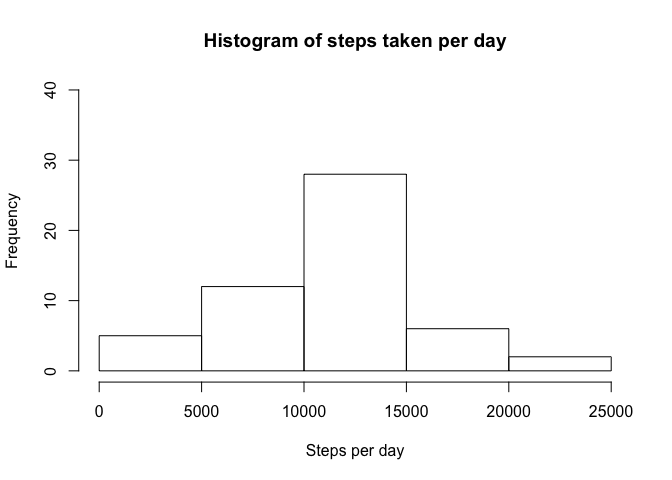
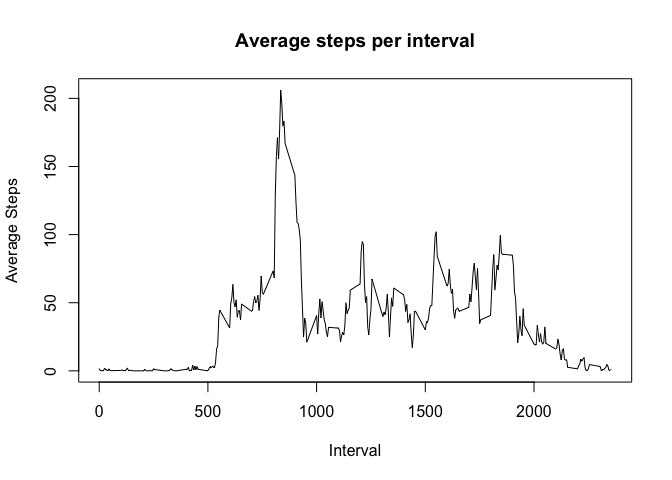
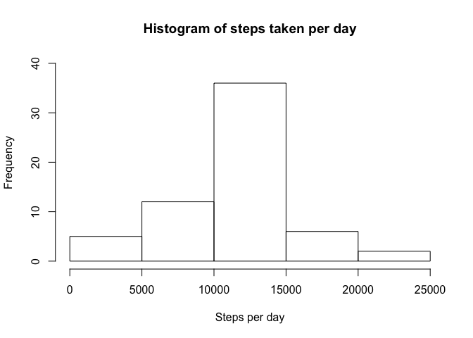
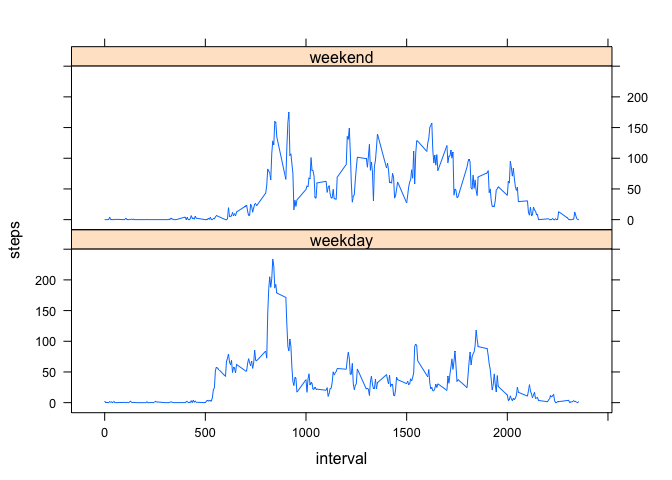

# Reproducible Research: Peer Assessment 1
## Introduction

It is now possible to collect a large amount of data about personal
movement using activity monitoring devices such as a
[Fitbit](http://www.fitbit.com), [Nike
Fuelband](http://www.nike.com/us/en_us/c/nikeplus-fuelband), or
[Jawbone Up](https://jawbone.com/up). These type of devices are part of
the "quantified self" movement -- a group of enthusiasts who take
measurements about themselves regularly to improve their health, to
find patterns in their behavior, or because they are tech geeks. But
these data remain under-utilized both because the raw data are hard to
obtain and there is a lack of statistical methods and software for
processing and interpreting the data.

This assignment makes use of data from a personal activity monitoring
device. This device collects data at 5 minute intervals through out the
day. The data consists of two months of data from an anonymous
individual collected during the months of October and November, 2012
and include the number of steps taken in 5 minute intervals each day.

## Data

The data for this assignment can be downloaded from the course web
site:

* Dataset: [Activity monitoring data](https://d396qusza40orc.cloudfront.net/repdata%2Fdata%2Factivity.zip) [52K]

The variables included in this dataset are:

* **steps**: Number of steps taking in a 5-minute interval (missing
    values are coded as `NA`)

* **date**: The date on which the measurement was taken in YYYY-MM-DD
    format

* **interval**: Identifier for the 5-minute interval in which
    measurement was taken


The dataset is stored in a comma-separated-value (CSV) file and there
are a total of 17,568 observations in this
dataset.


<br><br>

## Loading and preprocessing the data

```r
activity<-read.csv("activity.csv")
```
As can be seen below, the data has been correctedly loaded into the data frame **activity**:

```r
str(activity)
```

```
## 'data.frame':	17568 obs. of  3 variables:
##  $ steps   : int  NA NA NA NA NA NA NA NA NA NA ...
##  $ date    : Factor w/ 61 levels "2012-10-01","2012-10-02",..: 1 1 1 1 1 1 1 1 1 1 ...
##  $ interval: int  0 5 10 15 20 25 30 35 40 45 ...
```


```r
head(activity)
```

```
##   steps       date interval
## 1    NA 2012-10-01        0
## 2    NA 2012-10-01        5
## 3    NA 2012-10-01       10
## 4    NA 2012-10-01       15
## 5    NA 2012-10-01       20
## 6    NA 2012-10-01       25
```
Also, the variable ``steps`` contains several missing
    values coded as `NA`. These will be imputed later in this assigment.

<br><br>

## What is mean total number of steps taken per day?
#### 1. Calculate the total number of steps taken per day
In order to calculate the total number of steps per day, the data is aggregated by day and summed up:


```r
activity_daysum<-aggregate(steps ~ date, data=activity, FUN=sum)
```


```r
library(xtable)
activity_daysum<-aggregate(steps ~ date, data=activity, FUN=sum)
xt<-xtable(activity_daysum)
print(xt, type="html")
```

<!-- html table generated in R 3.3.0 by xtable 1.8-2 package -->
<!-- Mon Aug  1 21:53:37 2016 -->
<table border=1>
<tr> <th>  </th> <th> date </th> <th> steps </th>  </tr>
  <tr> <td align="right"> 1 </td> <td> 2012-10-02 </td> <td align="right"> 126 </td> </tr>
  <tr> <td align="right"> 2 </td> <td> 2012-10-03 </td> <td align="right"> 11352 </td> </tr>
  <tr> <td align="right"> 3 </td> <td> 2012-10-04 </td> <td align="right"> 12116 </td> </tr>
  <tr> <td align="right"> 4 </td> <td> 2012-10-05 </td> <td align="right"> 13294 </td> </tr>
  <tr> <td align="right"> 5 </td> <td> 2012-10-06 </td> <td align="right"> 15420 </td> </tr>
  <tr> <td align="right"> 6 </td> <td> 2012-10-07 </td> <td align="right"> 11015 </td> </tr>
  <tr> <td align="right"> 7 </td> <td> 2012-10-09 </td> <td align="right"> 12811 </td> </tr>
  <tr> <td align="right"> 8 </td> <td> 2012-10-10 </td> <td align="right"> 9900 </td> </tr>
  <tr> <td align="right"> 9 </td> <td> 2012-10-11 </td> <td align="right"> 10304 </td> </tr>
  <tr> <td align="right"> 10 </td> <td> 2012-10-12 </td> <td align="right"> 17382 </td> </tr>
  <tr> <td align="right"> 11 </td> <td> 2012-10-13 </td> <td align="right"> 12426 </td> </tr>
  <tr> <td align="right"> 12 </td> <td> 2012-10-14 </td> <td align="right"> 15098 </td> </tr>
  <tr> <td align="right"> 13 </td> <td> 2012-10-15 </td> <td align="right"> 10139 </td> </tr>
  <tr> <td align="right"> 14 </td> <td> 2012-10-16 </td> <td align="right"> 15084 </td> </tr>
  <tr> <td align="right"> 15 </td> <td> 2012-10-17 </td> <td align="right"> 13452 </td> </tr>
  <tr> <td align="right"> 16 </td> <td> 2012-10-18 </td> <td align="right"> 10056 </td> </tr>
  <tr> <td align="right"> 17 </td> <td> 2012-10-19 </td> <td align="right"> 11829 </td> </tr>
  <tr> <td align="right"> 18 </td> <td> 2012-10-20 </td> <td align="right"> 10395 </td> </tr>
  <tr> <td align="right"> 19 </td> <td> 2012-10-21 </td> <td align="right"> 8821 </td> </tr>
  <tr> <td align="right"> 20 </td> <td> 2012-10-22 </td> <td align="right"> 13460 </td> </tr>
  <tr> <td align="right"> 21 </td> <td> 2012-10-23 </td> <td align="right"> 8918 </td> </tr>
  <tr> <td align="right"> 22 </td> <td> 2012-10-24 </td> <td align="right"> 8355 </td> </tr>
  <tr> <td align="right"> 23 </td> <td> 2012-10-25 </td> <td align="right"> 2492 </td> </tr>
  <tr> <td align="right"> 24 </td> <td> 2012-10-26 </td> <td align="right"> 6778 </td> </tr>
  <tr> <td align="right"> 25 </td> <td> 2012-10-27 </td> <td align="right"> 10119 </td> </tr>
  <tr> <td align="right"> 26 </td> <td> 2012-10-28 </td> <td align="right"> 11458 </td> </tr>
  <tr> <td align="right"> 27 </td> <td> 2012-10-29 </td> <td align="right"> 5018 </td> </tr>
  <tr> <td align="right"> 28 </td> <td> 2012-10-30 </td> <td align="right"> 9819 </td> </tr>
  <tr> <td align="right"> 29 </td> <td> 2012-10-31 </td> <td align="right"> 15414 </td> </tr>
  <tr> <td align="right"> 30 </td> <td> 2012-11-02 </td> <td align="right"> 10600 </td> </tr>
  <tr> <td align="right"> 31 </td> <td> 2012-11-03 </td> <td align="right"> 10571 </td> </tr>
  <tr> <td align="right"> 32 </td> <td> 2012-11-05 </td> <td align="right"> 10439 </td> </tr>
  <tr> <td align="right"> 33 </td> <td> 2012-11-06 </td> <td align="right"> 8334 </td> </tr>
  <tr> <td align="right"> 34 </td> <td> 2012-11-07 </td> <td align="right"> 12883 </td> </tr>
  <tr> <td align="right"> 35 </td> <td> 2012-11-08 </td> <td align="right"> 3219 </td> </tr>
  <tr> <td align="right"> 36 </td> <td> 2012-11-11 </td> <td align="right"> 12608 </td> </tr>
  <tr> <td align="right"> 37 </td> <td> 2012-11-12 </td> <td align="right"> 10765 </td> </tr>
  <tr> <td align="right"> 38 </td> <td> 2012-11-13 </td> <td align="right"> 7336 </td> </tr>
  <tr> <td align="right"> 39 </td> <td> 2012-11-15 </td> <td align="right">  41 </td> </tr>
  <tr> <td align="right"> 40 </td> <td> 2012-11-16 </td> <td align="right"> 5441 </td> </tr>
  <tr> <td align="right"> 41 </td> <td> 2012-11-17 </td> <td align="right"> 14339 </td> </tr>
  <tr> <td align="right"> 42 </td> <td> 2012-11-18 </td> <td align="right"> 15110 </td> </tr>
  <tr> <td align="right"> 43 </td> <td> 2012-11-19 </td> <td align="right"> 8841 </td> </tr>
  <tr> <td align="right"> 44 </td> <td> 2012-11-20 </td> <td align="right"> 4472 </td> </tr>
  <tr> <td align="right"> 45 </td> <td> 2012-11-21 </td> <td align="right"> 12787 </td> </tr>
  <tr> <td align="right"> 46 </td> <td> 2012-11-22 </td> <td align="right"> 20427 </td> </tr>
  <tr> <td align="right"> 47 </td> <td> 2012-11-23 </td> <td align="right"> 21194 </td> </tr>
  <tr> <td align="right"> 48 </td> <td> 2012-11-24 </td> <td align="right"> 14478 </td> </tr>
  <tr> <td align="right"> 49 </td> <td> 2012-11-25 </td> <td align="right"> 11834 </td> </tr>
  <tr> <td align="right"> 50 </td> <td> 2012-11-26 </td> <td align="right"> 11162 </td> </tr>
  <tr> <td align="right"> 51 </td> <td> 2012-11-27 </td> <td align="right"> 13646 </td> </tr>
  <tr> <td align="right"> 52 </td> <td> 2012-11-28 </td> <td align="right"> 10183 </td> </tr>
  <tr> <td align="right"> 53 </td> <td> 2012-11-29 </td> <td align="right"> 7047 </td> </tr>
   </table>

The table above contains only 53 days, while the original data frame had 61. The difference is explained by the number of days that have missing data, ie, that do not contain steps.

<br><br>

#### 2. Make a histogram of the total number of steps taken each day

```r
hist(activity_daysum$steps, main="Histogram of steps taken per day", xlab="Steps per day", ylim = c(0,40))
```

<!-- -->


#### 3. Calculate and report the mean and median of the total number of steps taken per day
Using `activity_daysum` the mean and median number of steps taken per day can be determined:

```r
meansteps<-mean(activity_daysum$steps)
mediansteps<-median(activity_daysum$steps)
```
* The **mean** number of steps per day is 10766.1886792.

* The **median** number of steps per day is 10765.

<br><br>

## What is the average daily activity pattern?
#### 1. Make a time series plot (i.e. 𝚝𝚢𝚙𝚎 = "𝚕") of the 5-minute interval (x-axis) and the average number of steps taken, averaged across all days (y-axis)
Using the `aggregate` function the average number of steps per interval across all days is calculated and plotted subsequently.

```r
activity_interval<-aggregate(steps ~ interval, data=activity, FUN=mean)
plot(activity_interval$interval, activity_interval$steps, type='l',main="Average steps per interval", xlab="Interval", ylab="Average Steps")
```

<!-- -->

#### 2. Which 5-minute interval, on average across all the days in the dataset, contains the maximum number of steps?

The interval with on average maximum steps is calculated using

```r
activity_interval$interval[activity_interval$steps==max(activity_interval$steps)]
```

```
## [1] 835
```

The maximum average number of steps occurs in interval 835 and is found to be 206.1698113 (see also plot above).

## Imputing missing values
#### 1. Calculate and report the total number of missing values in the dataset (i.e. the total number of rows with 𝙽𝙰s)

As shown above, the dataset contains missing data coded as `NA` in column `Steps`. The total number of rows with missing data is determined using

```r
sum(is.na(activity[,1]))
```

```
## [1] 2304
```

The dataset contains 2304 rows with missing data.

#### 2. Devise a strategy for filling in all of the missing values in the dataset. The strategy does not need to be sophisticated. For example, you could use the mean/median for that day, or the mean for that 5-minute interval, etc.


#### 3. Create a new dataset that is equal to the original dataset but with the missing data filled in.


```r
activityALL<-activity
for(i in 1:length(activityALL$steps)) {
        if(is.na(activityALL$steps[i])) {
                activityALL$steps[i]=activity_interval$steps[which(activity_interval$interval==activityALL$interval[i])]
        }
}
```


#### 4. Make a histogram of the total number of steps taken each day and Calculate and report the mean and median total number of steps taken per day. 


```r
activity_daysum<-aggregate(steps ~ date, data=activityALL, FUN=sum)
hist(activity_daysum$steps, main="Histogram of steps taken per day", xlab="Steps per day", ylim = c(0,40))
```

<!-- -->

Using `activity_daysum` the mean and median number of steps taken per day can be determined:

```r
meansteps<-mean(activity_daysum$steps)
mediansteps<-median(activity_daysum$steps)
```
* The **mean** number of steps per day is 10766.1886792.

* The **median** number of steps per day is 10766.1886792.


#### Do these values differ from the estimates from the first part of the assignment? What is the impact of imputing missing data on the estimates of the total daily number of steps?

Imputing the missing values with the mean value across all days for that particular interval

* does not change the mean value since the mean value is used to impute missing data
* shifts the median value to the mean value
* increases the frequency of steps per day in the center bin, ie, around the mean value.

<br><br>

## Are there differences in activity patterns between weekdays and weekends?

#### 1. Create a new factor variable in the dataset with two levels – “weekday” and “weekend” indicating whether a given date is a weekday or weekend day.


```r
activity$date<-as.Date(activity$date)
activity$day<-"weekday"
activity$day[(weekdays(activity$date)=="Sunday" | weekdays(activity$date)=="Saturday")]="weekend"
activity_interval<-aggregate(steps ~ interval+ day, data=activity, FUN=mean)
```

#### 2. Make a panel plot containing a time series plot (i.e. 𝚝𝚢𝚙𝚎 = "𝚕") of the 5-minute interval (x-axis) and the average number of steps taken, averaged across all weekday days or weekend days (y-axis).


```r
xyplot(steps ~ interval | day, data = activity_interval, layout = c(1, 2), type='l')
```

<!-- -->

The plot above demonstrates different activity patterns during weekend and weekdays.  

Assuming that the intervals follow a daily routine, the following observations can be made:

* Early and late intervals show low number of steps, ie, low physical activity. One explanation for this is that a high number of subjects were asleep durin these early and late hours of the day.
* During weekdays a pronounced activity peak accurs around 835 and is 234.1025641. In comparison to weekends, this peak is sharper and higher, and might indicate the morning route and commute to work.
* This peak phase is followed by a low-activity phase, lower also in comparison to weekends. An interpretation could be seditary work during office hours.
